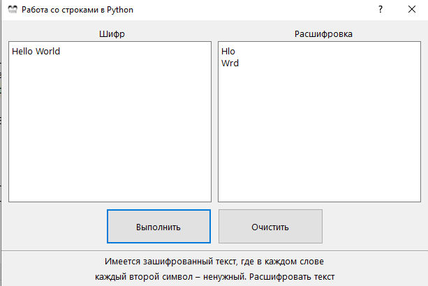

# Python_3_PyQt5_String
Работа с визуальными тестовыми данными в Python 3 с PyQt5



```
    def solve(self):
        self.textEdit_words.clear()
        text = self.textEdit_text.toPlainText()  # получаем наш текст
        txt=text.split()
        for s in txt:
            self.textEdit_words.insertPlainText(s[::2]+"\n")
            
            ```
